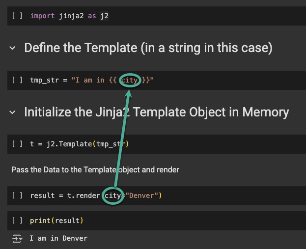

footer: NAF AutoCon3 © EIA 
slidenumbers: true


# Patterns & Templates

*...have been around for a long time!*

Web Development has given us some amazing tools to manipulate text (HTML) and documents.   Variable substitution is its simplest form.

Enter the Python module **Jinja2**


---

# Course Requirements

1. Browser & Internet Connection
2. Basic Python Knowledge
3[Google Colab account (Free)](https://colab.research.google.com/)
4. UV installed ([Installing UV](https://docs.astral.sh/uv/getting-started/installation/))
5. Clone or Download this repository [ac3 intro to jinja2](https://github.com/cldeluna/ac3_intro_to_jinja)

---

# What problem are we trying to solve?

How many times have you seen something like this?

```
interface e1/0/1
  description <Enter interface description here>
```
We have to give up the idea of people filling values manually. 

---
# Why should I care about this?

As Network Engineers we use templates daily.
- Configurations
- Outage emails
- Change Requests
- Work Instructions
- Anything that is text

Jinja2 is the de facto standard in Network Automation workflows.

^ 
We need a "pattern engine" and 

---

# Why are we here?

You may be saying "..but I already have templates!"

I've see templates in:

- Microsoft Word
- Notepad (Text)
- PowerPoint
- Excel
- *The last device I configured*

---

# Humans should be out of the variable subsitution business

- It does not scale
- It is prone to errors
- It allows inconsitency
- It kills reproducability
- It takes too much time
- Its not very rewarding (in and of itself)

---

# What is Jinja2?


Jinja2 is an open source text-based templating engine (module) for the Python programming language. 
It gained adoption due to is flexibility and Python-like syntax.  
While it has its roots as a web/HTML templating language, it is well-suited for generating a wide range of text output formats.

---
# Jinja2 Versions

- Version 1
    Obsolete
- Version 2 <-- *We are here*
    The current version (3.1.6) is still referred to as Jinja2

---
# Jinja2 Components

The Jinja2 Module
The Execution Environment
- Template
- Data


---

# Templates

- are typically text files with a .j2 extension
- they can also be variables in a python script

```jinja
% cat simple_template.j2
! Simple Template
{{ my_var }}

```
```jinja
% cat vlan_list.j2
! Layer 2 Vlan Template
! using a List of Lists


vlan {{ line[0] }}
  name {{ line[1] }}

```


---


---


---

# [fit] PREVIEW

---

# Exercise 1 - On Line 

Przemek Rogala's [J2Live Online Jinja2 Parser and Renderer by TTL255](https://j2live.ttl255.com/)

[Packet Coders Jinja2 Renderer](https://nebula.packetcoders.io/j2-render/)

^
Template:

My name is {{ name }}
I am in {{ city }}

{{ someothervar }}
{{ myvar }}
Data (Dictionary)
{ 
  "name": "Claudia",
  "myvar": 0,
  "city": "Prague",
}


---

# Execution Environment


Ultimately Jinja2 will be a tool in your automation workflow
- Python
- Ansible
- Vendor tools like Cisco Catalyst Center (DNAC)
- Other Automation Environments

---

# [fit] LANGUAGE 
# [fit] SYNTAX


---

# Variables
Outside a control structure
```
{{ var }}
{{ mylist[0] }}
{{ mydict.key }}  OR {{ mydict[key] }}
```
*Note: Undefined variables render as empty strings by default!*

---

# Variables 


Outside of a control structure

```
{{ var }}
```

Inside a control structure

```

```

Note the absence of the double curly braces when a variable is part of a control structure. 

---

# Control Structures 

Comparison between Python and Jinja2 

- In Python, blocks use indentation and may or may not have a close statement
- In Jinja2, blocks use  and  (they generally have a close statement)


---

# Control Structures - Loops

For Loop
```

   {{ intf }}

```

---

# Control Structures - Conditionals

IF/ELIF/ELSE

```

    Legacy stack is too big!

    Stack Size is Good

    ERROR...BAD Max Stack Value {{ ms_int }}

```

---

# Assignments

Define a variable within the Template
```

```

Cast to integer (using a built in Filter)
```

```

---

# Filters


^
https://jinja.palletsprojects.com/en/stable/templates/

---

# Tests

Jinja comes with built in tests.
It is very easy to define your own 
```
! Is the variable defined

The variable val exists and has a value of {{ val }} 

```


^
https://jinja.palletsprojects.com/en/stable/templates/


---

# Conditions and Operators


---
# False in Jinja2

What evaluates to False in Jinja2?
- false
- none
- 0 (zero)
- Empty sequences ([], (), {}, set())
- Empty strings ("")
- Special value undefined


---
# Truth may not behave as expected

These are not interchangeable across contexts:
- In Python code, using true will result in a NameError
- In Jinja2 templates, using True will not be recognized as a boolean
- In Jinja2 type matters

---

# Be Careful With Truth

```
 
    Using 'is' test works on a boolean

    Fails: checks for exact boolean true


 
    "Truthy" true

```


---

# [fit] WORKFLOW
# [fit] ENVIRONMENT

---


---

# Environment Options

Load your Templates from
- A Python Package
- A Directory
- A String Variable

```jinja
jinja2.Environment(loader=<>)
```


---
# Jinja2 Environment Loaders


```
# env_examples
.
├── j2_env_loader_examples.py
├── app_templates
│   ├── __init__.py
│   └── simple_template.j2
├── dir1
│   └── dir2
│       └── simple_template.j2
└── templates
    └── simple_template.j2

```


---

# Exercise 2 - Load and Render via CLI

Python Interactive Interpreter or REPL (Read, Evaluate, Print, and Loop)

```bash
% uv run python
Using CPython 3.11.12
Creating virtual environment at: .venv
Installed 2 packages in 4ms
Python 3.11.12 (main, Apr  9 2025, 03:49:53) [Clang 20.1.0 ] on darwin
Type "help", "copyright", "credits" or "license" for more information.
>>> import jinja2 as j2
>>> exit()
```

OR

[Google Colab](https://colab.research.google.com/drive/1Qrl9WZ9y3ryrrV3BnDP4w65MfOlBth3R?usp=sharing)


---


# Exercise 3 - Load and Render in Python

Template (Environment) Loading

```bash
claudiadeluna in ~/ac3_intro_to_jinja/env_examples on main
% uv run j2_env_loader_examples.py

--- Loading from STRING ---
Hello World!
Available templates: (not applicable for string-based templates)

--- Loading from FILESYSTEM ---
Available templates: ['simple_template.j2', 'test_named.j2']
Hello from Filesystem!
This is the simple_template.j2 rendered by Jinja2.

--- Loading from PACKAGE ---
Available templates: ['__init__.py', '__pycache__/__init__.cpython-311.pyc', 'simple_template.j2']
Hello from Package!
This is the simple_template.j2 rendered by Jinja2.

--- Loading from INDIVIDUAL FILE PATH ---
Available templates: (not applicable for direct file loading)
Hello from Anywhere!
This is the simple_template.j2 rendered by Jinja2.
claudiadeluna in ~/ac3_intro_to_jinja/env_examples on main
%    
```

---

# [fit] PAYLOAD
# [fit] DATA

---

# Passing Data to Templates

Getting the data into your template and rendering can be confusing at first.

As the complexity of your payload increases, so will your template complexity.

---




---

# Python Unpacking Behavior

This works with lists and dictionaries in Python
When working with Jinja2 focus on putting your payload in dictionaries so you can be very explicit about picking out the exact data you want because you can referenc either by name.


---

# Jinja 2 Unpacking Behavior


```jinja
template.render(cfg_data) # equivalent to template.render(**cfg_data)
```

Unpacking (\*\*) is the default behavior in Jinja2
so if your cfg_data is a dictionary with one key/value pair 
```{“hostname”: “my_switch”}```
{{ hostname }} in the template will render to “my\_switch”

---

# Jinja 2 "Named" Data

```jinja
template.render(cfg=cfg_data) 
```
If you don’t assign your payload to a specific name (like cfg=cfg\_data), by default, Jinja2 will make the dictionary keys available as top-level variables in the template (vs. key/value pairs). 	

```
Given a dictionary {"fruit": "mango"}
Its the difference between accessing your data as a dictionary
{{ cfg['fruit']}}
or accessing your data as a top level variable 
{{ fruit }}
```

---

# Jinja 2 Unpacking Behavior

While using the “unpacking” default behavior can be a bit more streamlined, it inhibits the ability to dump the payload in the template if you are troubleshooting or unsure of the keys or structure.
``` {{ cfg }} ```
I find the ability to do this very useful, so I generally always assign my payload (script variable) to a template variable.

script variable "cfg\_data" passed to template variable "cfg"
```jinja
template.render(cfg=cfg_data) 
```

Note:  The online tools expected a dictionary and now you know why!

---


---

# Exercise 4 - Data


---

# [fit] WHITE
# [fit] SPACE


---

# Spaces and Line Feeds can be Tricky in Jinja2

Control structures can add unwanted whitespace and empty lines.
Often it will come down to what you can live with and the functional impact of any extraneous whitespace when you push your configs.
- “One liners” can help
- Jinja2 has several white space management options

--- 
# Whitespace control with "-"

The minus sign can be used to control whitespace
```
  Removes whitespace before the tag 
   Removes whitespace after the tag 
   Removes whitespace both before and after the tag
{{- cfg -}} Removes whitespace both before and after the variable
```

--- 

# Whitespace control with "+"

The plus sign preserves white space which would normally be removed. While its use is less common it can be useful as an override particularly if you set whitespace controls when defining your environment.
```
 Preserve indentation
```

---

# Whitespace control during Environment defintion


---

# Exercise 5 - Whitespace

---

# [fit] REAL WORLD
# [fit] EXAMPLE


---
# Lets put it all together

Lets generate switch configurations for an MLAG pair along with summary text which can be included in a Change Request ticket.

1. Template
2. Payload
3. Python script

---

# Exercise 6 - Use Case

```
% cd exercise6

% uv run gen_sw_configs.py 

================================================================================
Generating Switch Configs and Change Request Ticket Summary

There are 3 templates available in the FileSystemLoader environment ['templates']:
        - switch_config.j2
        - switch_summary.j2
        - switch_summary_oneliner.j2

--------------------------------------------------------------------------------
Generated config for switch-01 at ./output_configs/switch-01_config.txt
Generated config for switch-02 at ./output_configs/switch-02_config.txt

Completed generating configs for 2 switches.

--------------------------------------------------------------------------------
Ticket Summary:

Switch Deployment Summary:
- Hostname: switch-01
- Management IP: 192.168.1.10/24


Switch Deployment Summary:
- Hostname: switch-02
- Management IP: 192.168.1.11/24


================================================================================

```

---

# Conclusion

Any text is fair game for Jinja2
Don't limit yourself to configurations 

---


# Creating Templates with AI

This is an area where "AI" (next word prediction at scale) can be a time saver if you know your fundamentals.

So:
- don’t be afraid to tell your AI buddy they are wrong!
- double check and test, test, test. 
- this is like “verbal” coding so be precise in your prompts

---

# Great on line resources to get us started 

    https://j2live.ttl255.com/
    http://jinja.quantprogramming.com/
    https://nebula.packetcoders.io/j2-render/
    https://runcode.io/jinja-online-coding-platform (Requires Registration) (unstable)

