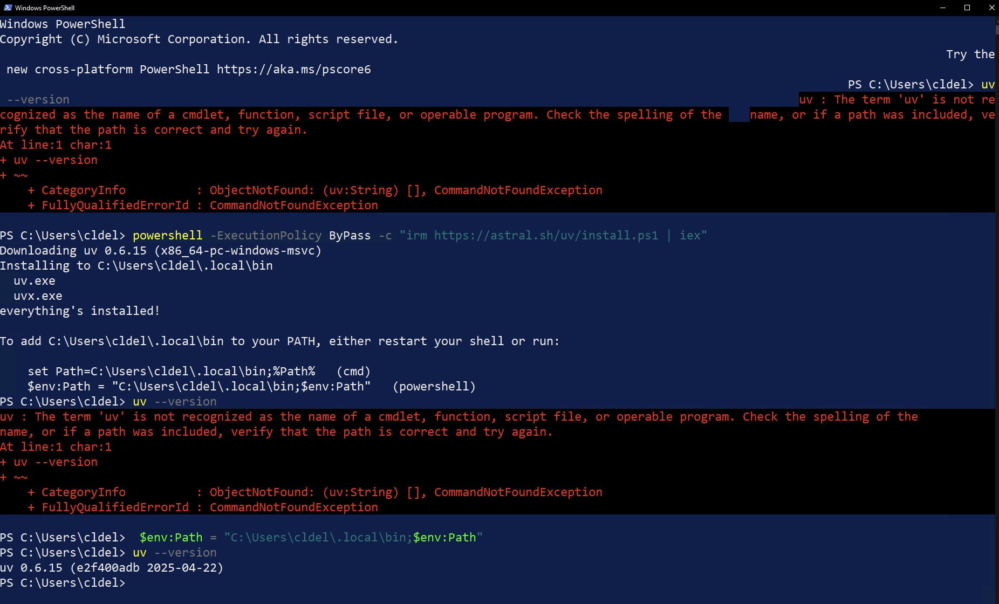

# Introduction to Jinja2

Jinja2 primer for the NAF AutoCon3 Templating Workshop [https://networkautomation.forum/autocon3#workshop](https://networkautomation.forum/autocon3#workshop)


## Executing the scripts in this repository

We will be using uv to build the virtual environment and execute the scripts in this repository.

#### What is UV?

[Astral's](https://astral.sh/) **uv** is a fast, all-in-one Python package and project manager written in Rust that unifies and accelerates Python development workflows by replacing multiple tools—including pip, pip-tools, poetry, pipx, pyenv, virtualenv, and twine—with a single, high-performance utility. It handles package installation, dependency resolution, virtual environments, project and Python version management, script execution, and package publishing, all with a familiar CLI and dramatic speed improvements. By consolidating these capabilities, uv simplifies and streamlines Python development for everything from individual scripts to complex multi-workspace projects.

#### Why are we using it?

This repository was inspired by [NAF's](https://networkautomation.forum/) [AutoCon3](https://networkautomation.forum/autocon3) [Templating workshop](https://networkautomation.forum/autocon3#workshop).

Because **uv** is a comprehensive package manager it will be easier to create the necessary **Python execution environments** for the scripts we will be executing in our Jinja2 workshop.

## Install UV

### Mac and Linux

```bash
curl -LsSf https://astral.sh/uv/install.sh | sh

# Add to the current PowerShell session’s PATH (or open a new terminal window):
source $HOME/.local/bin/env

# Verify it worked (See screen shot below for expected output)
uv --version
```


### Windows (PowerShell)

Install uv using PowerShell

``` powershell
powershell -ExecutionPolicy ByPass -c "irm https://astral.sh/uv/install.ps1 | iex"
```



When you install `uv` on **Windows using PowerShell**, the installer typically adds the `uv` binary to your user’s `AppData\Local\uv\bin` directory and updates the `Path` environment variable to add that directory.  However, **this change won't take effect in the same terminal session unless you manually update the `PATH` variable**.

```powershell
# Update the PATH in your current PowerShell session so you can use uv right away.
# Make sure you include the quotes
"$env:USERPROFILE\AppData\Local\uv\bin"

# Temporarily add to the current PowerShell session’s PATH:
$env:Path += ";$env:USERPROFILE\AppData\Local\uv\bin"

# Verify it worked
uv --version

```

If you have any problems, open up a new PowerShell window and try to execute the `uv --version` command.

If that does not work, please review the uv installation instructions:

##### [Official UV Installation Guide](https://docs.astral.sh/uv/getting-started/installation/)

Tip: Make It Permanent (System/User Environment Variable)

If you want `uv` to always be available from any new PowerShell terminal:

```
[Environment]::SetEnvironmentVariable("Path", $env:Path + ";$env:USERPROFILE\AppData\Local\uv\bin", "User")
```

Then open up a new PowerShell terminal.

---

## What to do with this Repository?

**Download or Clone** the repository and move into the repository directory (unzip if you used the download option).

No virtual environment needs to be built or activated.

Remember to run all scripts and interactive shells with ```uv run```.


### Handy Commands

| Command                                        | Description                                                  |
| ---------------------------------------------- | ------------------------------------------------------------ |
| `uv --version`                                 | Good test to confirm **uv** is installed as well as checking the version |
| `uv python list`                               | Will display the versions of Python available/installed under **uv** management |
| `uv python install 3.10`                       | Install the latest version of Python 3.10 under uv. This is functionaly often implemented with `pyenv`. |
| `uv init`                                      | Initializes the repository `uv` style                        |
| `uv add --python 3.12 module1 module2 module3` | UV will add the required version of Python and the modules <br />to the repository ***pyproject.toml***.  This gives the scripts in the repository  <br />the Python and modules needed to executed (run) under **uv** to create the  <br />required virtual environment without any further action from the user. |
| `uv run myscript.py`                           | This is the equivalent of of 'python myscript.py' but running it <br />under **uv** manages the virtual environment creation. |
| `uv sync `                                     | Updates the virtual environment                              |
|                                                |                                                              |
